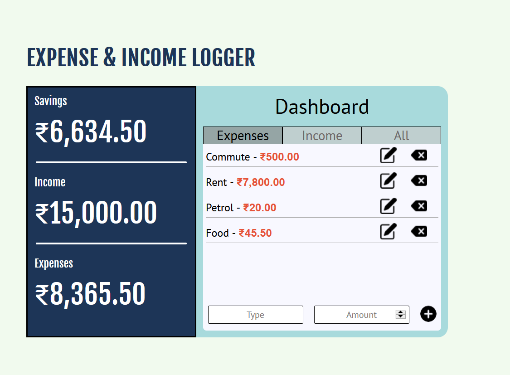
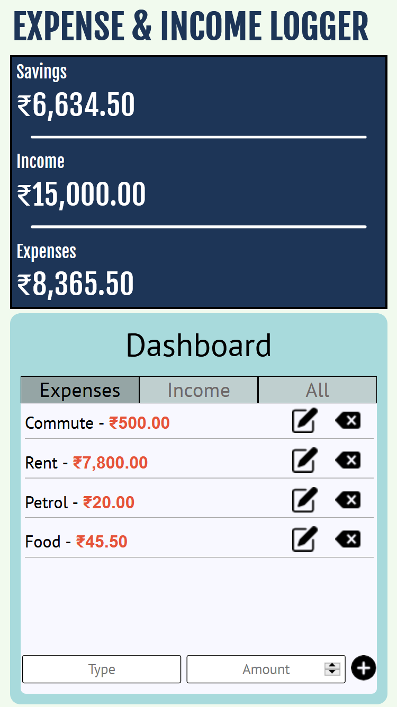

### Screenshots

**Desktop View**

**Mobile View**

### Learning Resources 

https://stackoverflow.com/questions/22641074/html5-number-input-always-show-2-decimal-places

[insertAdjacentHTML()] https://developer.mozilla.org/en-US/docs/Web/API/Element/insertAdjacentHTML

https://stackoverflow.com/questions/57111065/what-is-the-difference-between-insertadjacenthtml-and-insertadjacentelement

[Local Storage] https://developer.mozilla.org/en-US/docs/Web/API/Window/localStorage

[Event Target] https://developer.mozilla.org/en-US/docs/Web/API/Event/target

JSON https://javascript.info/json

https://developer.mozilla.org/en-US/docs/Web/CSS/box-shadow

[Number.toFixed()] https://developer.mozilla.org/en-US/docs/Web/JavaScript/Reference/Global_Objects/Number/toFixed
