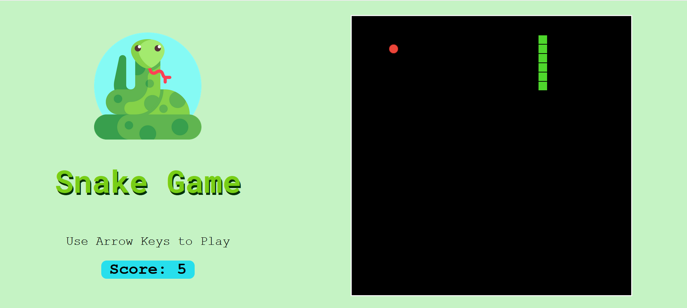

**HOSTED AT** - https://ww6mt.csb.app/

**Code Sandbox** - https://codesandbox.io/s/snake-game-ww6mt

### Learning Resources 

You provide `requestAnimationFrame()` with a function that it needs to run when it decided that the browser is ready. In case of the MDN's example, that function is called `step()`.

So here's how it goes:

The page loads.
`requestAnimationFrame(step)` is invoked.
`requestAnimationFrame()` decides that it's time and fires off step().
`step()` runs and does it's thing.
When `step()` is done with everything it fires off requestAnimationFrame() and passes itself to it.
They continue like this forevermore, invoking each other.

#### `setInterval` vs `setTimeout` vs `requestAnimationFrame`

https://developer.mozilla.org/en-US/docs/Web/API/window/requestAnimationFrame

https://css-tricks.com/using-requestanimationframe/

https://www.youtube.com/watch?v=QTcIXok9wNY